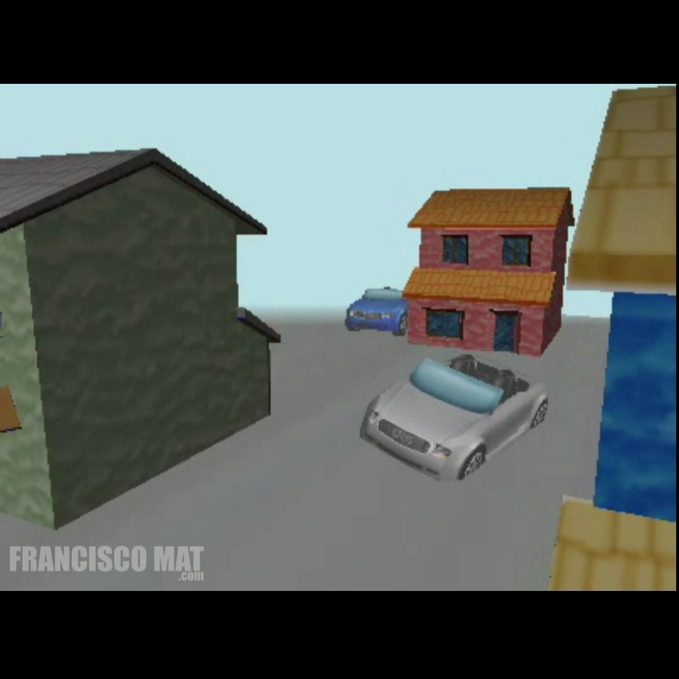

# City Cars Sequence - 3D Animation (2005)
by Francisco Mat
Made in 2005

https://www.youtube.com/watch?v=gqgGoTBJx3E

The singles 3D scenes was made in 2005, it was made with an open source audi car model and house with different colors textures.

* Made in Windows XP + Milkshape 3D + Anim8or.

Francisco Matelli Matulovic - 2005 - 2018